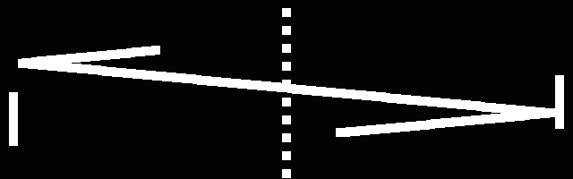

# *PONGS*

## [Play Online](https://pippinbarr.github.io/pongs/) (desktop only)

## Description
*Bip! Bip! Bip! Boop! Everyone loves PONG! So everyone loves thirty six PONGS even more! Work those learning muscles with EDUTAINMENT PONG! Get serious with SERIOUS PONG! Shoot a laser gun in LASER PONG! Play PONG in PONG PONG! And many more!*

Originally released on 11 April 2012) PONGS was written in ActionScript 3 using FlashBuilder 4.5 and the excellent [Flixel](http://www.flixel.org/) library.

This version has been ported to the also excellent [Phaser 3](https://phaser.io/) library for JavaScript.

You may not be surprised to hear that *PONGS* is based on Atari's PONG. Sound effects were made in [bfxr](http://www.bfxr.net/). The font in PONGS is [Commodore 64 Pixelized](http://www.dafont.com/commodore-64-pixelized.font) by [Devin Cook](http://www.devincook.com/). The references in PONGS are mostly pretty obvious, but if you haven't heard of [Shit Snake](http://www.draknek.org/games/shitsnake/) by [Draknek](http://www.draknek.org/) or [B.U.T.T.O.N.](http://gutefabrik.com/button.html) by [Die Gute Fabrik](http://gutefabrik.com/), then now you have!

## Press
PONGS was featured on [Kill Screen](https://killscreen.com/previously/articles/we-tried-all-36-pippin-barrs-variations-pong-so-you-dont-have-you-should/), [Free Indie Games](http://www.freeindiegam.es/2012/04/pongs-pippin-barr/), [The Verge](http://www.theverge.com/2012/4/11/2941458/pippin-barr-36-pongs-variations), [Rock, Paper, Shotgun](http://www.rockpapershotgun.com/2012/04/11/with-an-s-pongs-is-the-greatest-games/), ~~and [Edge Online](http://www.edge-online.com/features/friday-game-pongs)~~. It has also been discussed in German on [NEGATIV](http://www.negativ-film.de/pong-als-art-game-pippin-barrs-36-pongversionen/) ~~and [Superlevel](http://superlevel.de/spiele/pongs)!~~ [Lorenzo Pilia](http://www.tiif.it/) made an awesome controller for PONGS and you can [watch a video of it](http://www.youtube.com/watch?v=zLJdRQhcn0E)! *PONGS* has been exhibited many times.

## Documentation
* [Code repository](https://github.com/pippinbarr/pongs) (includes the new JavaScript source code as well as the Flash Builder version from 2011)
* [Journal](../process/journal.md) (blog posts written while I was making the original *PONGS*)
* Download the [original .swf file of PONGS](https://github.com/pippinbarr/pongs/releases/tag/swf) from the repository if you want

## License
*PONGS* is an open source game licensed under a [Creative Commons Attribution-NonCommercial 3.0 Unported License](http://creativecommons.org/licenses/by-nc/3.0/). You can obtain the source code from its [code repository](https://github.com/pippinbarr/pongs/) on GitHub.
